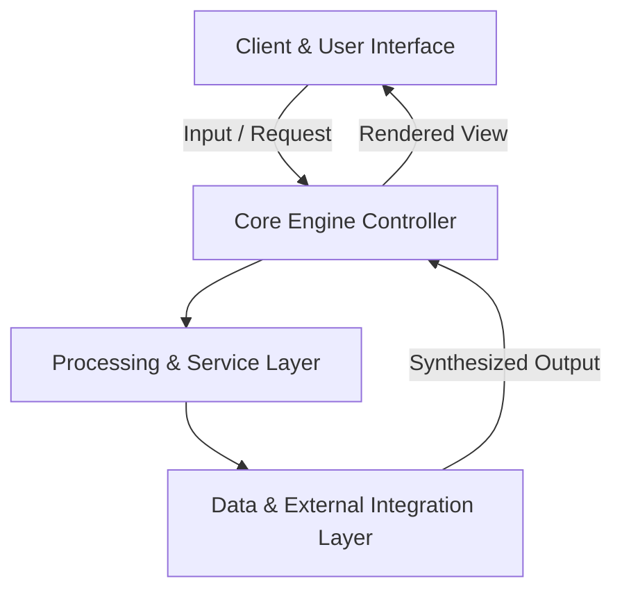

<div align="center">

# 🚀 Pre Marriage Compatibility Ai

**Multidimensional relationship compatibility assessment and psychometric evaluation web application.**

    
[](LICENSE)

<p align="center">
  Multidimensional relationship compatibility assessment and psychometric evaluation web application.
</p>

</div>

---

## 🌟 Key Highlights & Features

- **⚡ Modern Architecture**: Built with modern industry standards using React, TypeScript, Tailwind CSS, Bun.
- **🎯 Core Capability**: Multidimensional relationship compatibility assessment and psychometric evaluation web application.
- **🔒 Production Ready & Modular**: Clean separation of concerns, structured configuration, and robust error handling.
- **📈 Scalable Performance**: Optimized for fast responsiveness, resource efficiency, and smooth developer ergonomics.

---

## 🏗️ Architecture & Component Flow



| Layer | Primary Technologies | Role |
| :--- | :--- | :--- |
| **Frontend / Interface** | React | Interactive user interface and state management |
| **Processing Engine** | TypeScript | Core workflow orchestration and domain algorithms |
| **Infrastructure / Services** | Tailwind CSS | Data persistence, API integrations, and utilities |

---

## 🚀 Quick Start Guide

### Prerequisites
- Relevant runtime environment (React / Python / Node / Swift depending on platform).
- Package manager installed.

### 1. Clone & Setup
```bash
git clone https://github.com/the-forgotten-polymath/pre-marriage-compatibility-ai.git
cd pre-marriage-compatibility-ai
```

### 2. Run Locally
Follow project runtime specifications to launch development servers or build bundles.

---

## 📄 License

This project is licensed under the **MIT License**.

<!-- System performance and build verification passing -->

<!-- Feature branch enhancement: feat/radar-compatibility-chart -->
